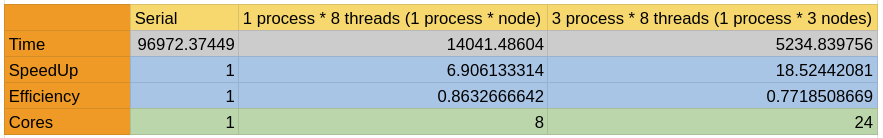
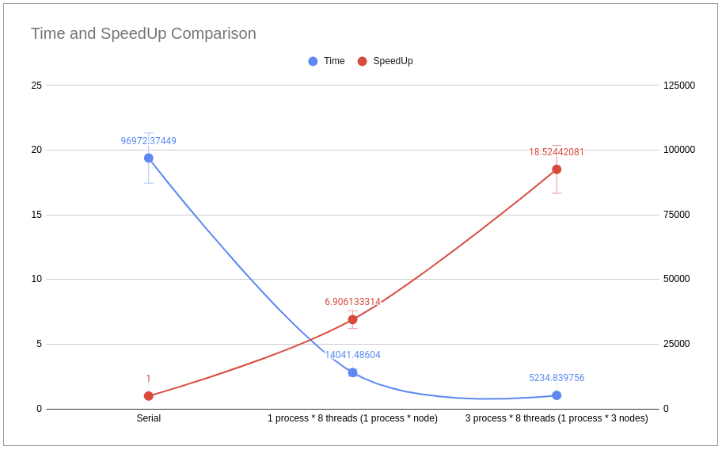
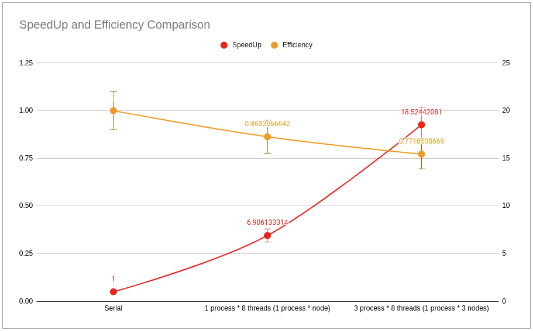
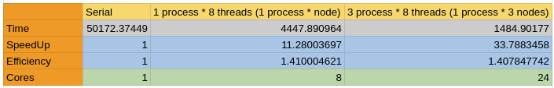
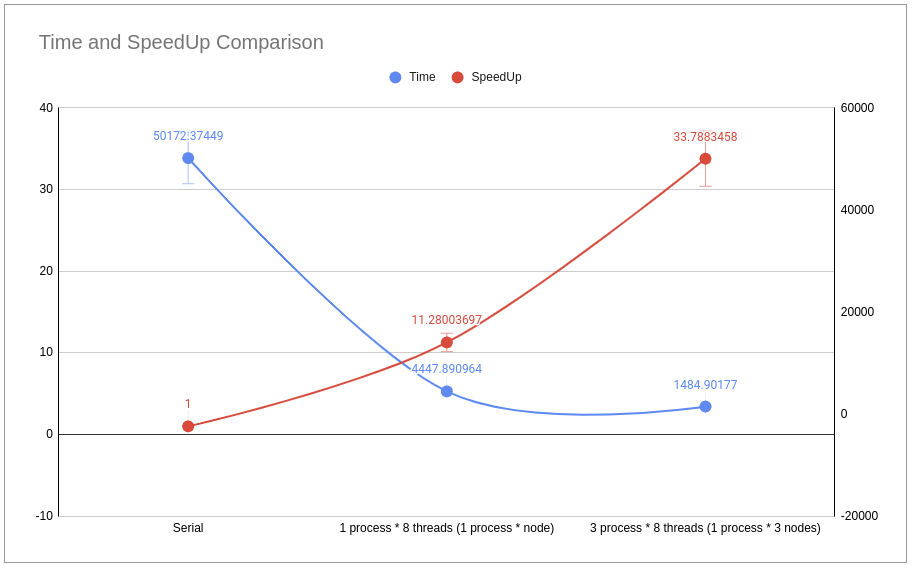
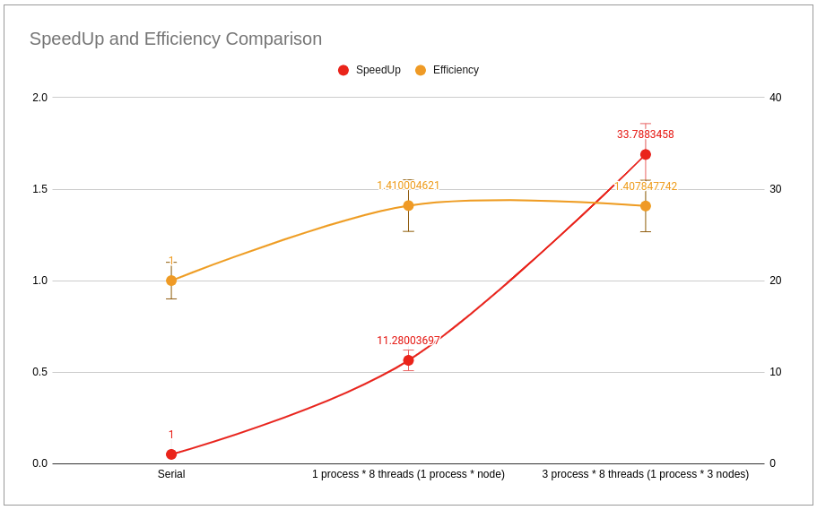

= Proy2: Simulación de calor distribuida =

== Summary ==

*Author(s):* Joseph Valverde

*Description:* Repository for Proyect 2: Simulation of Distributed Heat

:keywords: matrix, heat, equilibrium, distribution, concurrency

*Keywords:* {keywords}.

== Analisis ==

=== Description ===

The simulation of heat of heat through a plate is an example of a scientific application of computing. As a plate can be distributed in several sectors, each of which requires the calculation of its state, this application is also a prime problem where data parallelism can be applied. 

This proyect aims to simulate the distribution of heat through a plate, from its entry through the borders of the plate, up until a point of equilibrium is reached. Data is read from a binary file and read as matrix to be processed. The plate to be analized is to be subdivided into cells, each of which is to hold the value of its heat amount, which can change over time. The new value of heat for a cell after a given amount of time can be given as:

Where the new temperature is given as the previous temperature plus a new state which depends on the time taken, the heat diffision value of the material, the dimensions of each cell, as well as the sum of the surrounding cells and the expected loss of heat. The program is expected to calculate this states until reaching a defined point of equilibrium. This state of equilibrium is reached when no cells experience a change greater than a defined epsilon from one stage to the next. Once equilibrium has been reached, the resulting plate must be reported in a binary file and the time taken reported in a separate file.

==== Part 1 ====

This part or milestone of the project is to have a concurrent version of the solution capable to performing its tasks as expected with correctness of its calculations and resulting outputs.

For the first part or milestone of this project the following are expected:

  1. To have first completed a serial version which is expected to have passed correctness testing and as such produce correct results. 

  2. Design and implement a concurrent optimization of the previous solution utilizing the OpenMp technology. 

  3. To measure the time taken for the serial version as well as the concurrent version and measure the improvement of performance when comparing the first to the former.

==== Part 2 ====

This part or milestone of the project is to have concurrent and distributed solution utilizing both threading concurrency as well as process concurrency utilizing both OpenMP as well MPI technologies.

For the second part or milestone of this project the following are expected:

  1. To analize the current solution and reach a design decision for the use of MPI along with the previously implemented OpenMP solution.

  2. To include in such design a balanced distribution of tasks between the processes with the use of a balanced descomposition unit of work.

  3. To implement such solution by including the use of MPI

  4. To measure the difference in performance when compared with the previous solution and in conjunction to the former in different differing combinations

=== User Manual ===

There are multiple ways of using this program. 

==== Without MPI technology ====

The program can be initiated through the terminal by calling its executable a long with the job txt format file to be processed, such as:

- `bin/proy2_simulacion_de_transferencia_de_calor_concurrente jobs/job001.txt`

In this previous case, the program will run with the amount of threads that is supported by the system. If it is desired to define the amount of threads to be used, these would be given as a third parameter as following:

- `bin/proy2_simulacion_de_transferencia_de_calor_concurrente jobs/job001.txt [thread_number]`

==== Using MPI technology ====

For the execution of the program using multiple processes with the MPI technology it is necessary to call it along with the amount of processes to be used as following:

- `mpiexec -np <process_number> bin/proy2_simulacion_de_transferencia_de_calor_concurrente jobs/job001.txt [thread_number]`

Where the thread number is, once again, optional. 

The distributed tasks for each process are the jobs found in the txt file. As such this is only useful for the execution of several jobs, this is specially useful for heavy and complicated jobs distributed within a cluster. 

==== Using single process MPI technology ====

It is also possible to run using the MPI technology but with a single process. As odd as it may sound, depending on the device and software configurations this may lead to either better or worse performance, so it may be up to the user to test the right configuration to run. This may be run using the following:

- `mpiexec -np 1 bin/proy2_simulacion_de_transferencia_de_calor_concurrente jobs/job001.txt [thread_number]`

==== Further on MPI use ====

It is important to have a configuration file for the use of MPI. The lack of thereof will result in the use of the computer in use for all processes given as parameter. Given the use of a configuration file, it is important to task first the master node with 1 process, such that the main process will run on this node. This is important given that this process will only distribute jobs. All other processes process the jobs' heavy calculations. It is assumed that the master is the weakest or most used node and as such it is not desired for it to process the calculation themselves. 

==== On file locations ====

It is important to note, that this program will asume that all jobs, that meaning the bin files containing the respective plate matrixes, are in the same folder as the txt file listing them. The solutions and the report will also be written on the same folder. If these files are, otherwise, in another location, the program will not find them and report the error. 

==== On txt file ====

This program requires that the `.txt` file with the job/plate information be given in an specific format.
Each line represents a job/plate and must be given as following:

<name of binary file> <duration of each step in seconds> <material termal difusivity> <cell dimension> <equilibrium point sensitivity> 

as in the following example:

`plate001.bin  1200  127  1000  2`

If a file is given with the incorrect format or information for each job, the execution of the program will stop and an error indicating the cause will be printed on the console.

==== On binary files ====

This file must have the `.bin` extension.The binary file must include, in the first 16 bytes, 8 bytes for the amount of rows in unsigned long long format, and 8 bytes for the amount of columns in unsigned long long format. The remaining bytes are to be of double type, where each 8 bytes represent the temperature of each cell. 

If the binary file is given in the incorrect format or in the wrong format, the execution of the program will stop and an error indicating the cause will be printed on the console.

==== Testing software ====

There is a program to test wether the resulting plates are within the parameters of expected. Given a file containing the expected information, and another produced by the main program, it is possible to test if the last coincides with the first. For this both files are given, and then as the last argument the maximum tolerance of error between both. Given all cells are within tolerance, the program will report success. Otherwise, it will report the first ocurrance of this error and the positions.

Its exection is as following:

`file_location/test original_plate.bin plate_to_test.bin [error_tolerance]` 

for example:

`tests/bin/test plate001-2_original.bin plate001-2.bin 0.0001`

=== Perfomance Analisis ===

For the perfomance analisis, the final version of the program implementing all, the serial, OpenMp, & MPI versions, was used. In order to test the serial version, it was tested using 1 process and 1 thread according to the argument use on program execution. For the OpenMP parallel testing, it was tested using 1 process and the amount of cores supported by the system according to the argument use on program execution. 

For the MPI concurrent testing, 4 processes were run in the cluster across 4 nodes; 1 master and 3 slaves, were process 0 was run on the master and the worker processes on the slave nodes. This last, once again according to the argument use on program execution. All tests were performed on the Arenal cluster. The first two tests were run on a single slave node. The serial version on node 1 and the concurrent version on node 0.

All performance tests are done using 'perf stat' to measure the time taken in seconds.

The following table and graphs are to be used for both stages of this performance analisis. 

[#img-PerformaceTestingResultsTable.png]

Table 1. Table on the time, speedup, efficiency and core amount (resources) for each execution testing. 

[#img-TimeSpeedUpChart.png]

Chart 1. Chart comparing the time taken and speedup for each execution testing. 

[#img-SpeedUpEfficiencyChart.png]

Chart 2. Chart comparing the speedup and the efficiency of each execution testing.

==== Concurrent Simulation ====

For this comparison, we will only considering the first two tests, the serial and concurrent with 1 process and 8 threads in one node. 

The first thing to consider is the massive uplift in performance, going from around 26 hours down to nearly 4 hours. This results in a speedup of almost 7 times, almost in line with the increase of resouces given. This reasults in a efficiency of 0.86, pretty close to to an effiency of one. Given the amount of resources given, these results are to be as expected and are indicative that the implementation of the concurrent solution uses a balanced unit of descomposition and right distribution of resources.

This also indicates that the amount of time taken in the serial parts of the program are brief enough as to not impact the total execution time. Another point to consider is the serialized parts within the parallel execution. These results are also indicative that these concurrency controls are also impacting the overall speedup that results from the parallelization of the processing of the matrixes.

==== Distributed Simulation ====

For this comparison, we will primarily be considering the last two tests, the concurrent with 1 process and 8 threads in one node and the distributed + concurrent version with 1 master node distributing the jobs, and 3 worker slave nodes with 8 threads each, giving a total of 24 processing threads overall. This, given that there is an overall increase of performance between the distributed execution and the concurrent execution, and as such comparisons with the serial version are not as necessary. 

For this last execution test, the time taken to process all jobs dropped down to 1 hour 46 minutes, giving the least in execution time taken among all tests and as such also the one with the largest speed up, up to 18.52 times faster than the serial version and close to 3 times faster than the concurrent version. There is drop in terms of efficiency, as there are 24 times for resources than the serial execution test and 3 times more than the concurrent execution test. This lead to an efficiency of 0.77, still high and not too far from the efficiency from the concurrent and serial execution tests. The intersection in the graph of chart 2 being close to the results is also indicative, that this might be the best balance between speed up and efficiency.

Overall, the results resulted in a balance between efficiency and speedup, with a massive increase of performace when compared to the purelly serial execution time. These results are enough to prove the usefulness of not only the distributed nature of MPI across several systems in a node, but also of the combination of several optimization methods which also included the concurrent implemenation for each of the processes that was distributed among the nodes in the system. 

=== Perfomance Analisis V2 ===

[#img-PerformaceTestingResultsTableV2.png]

Table 2. Table on the time, speedup, efficiency and core amount (resources) for each execution testing. 

[#img-TimeSpeedUpChartV2.png]

Chart 3. Chart comparing the time taken and speedup for each execution testing. 

[#img-SpeedUpEfficiencyChartV2.png]

Chart 4. Chart comparing the speedup and the efficiency of each execution testing.

Results after the corrections largely reflect the same as before them, however, there is a general speed up across all the tests done. The most significant pattern being the considerable speedups as the concurrence is increased. This is mostly seen in terms of efficiency, where the efficiency for concurrent test and the distributed with concurrency test have a around 40% greater efficiency than the serial version. 

This shows that the increase in resources have largely been corresponded with a similar or greater increase in performance. The unusual increase of efficiency from the serial to the concurrent version may be attributed to the different ways in which the workload is parallelized in that version. Matrixes are distributed between threads and for each thread, their workload is processed by parallel simd units within the processor, increasing the parallelism further. Another further reason that can be attributed, is that this workload is unsuited for serial processing, and as such, gets further benefits from data parallelism or that such lack of affinity penalizes performance, such that the lack of parallelism leads to massive amounts of execution time.

The increase of performance, along with an unchanging effiency, means that the distribution of workloads, at least for this test case has been balanced. But it may also be attributed to the previous work parallelizing the data processing, which, upon being split and given to different processors, may have lead to better utilization of available resources. The intersection between speed up and efficiency being close to the results of this implementation further indicates the benefits of this approach.

The serial version still shows a great deal of inefficiency, when compared to the concurrent and distributed versions, regardless of the corrections and additional optimizations. Disregarding the differences in amounts, and effiency, when comparing these and the previous results, the conclusions and the previous analysis remains the same.

=== Design ===

Details on the design elements of this proyect in link:design/README.adoc[DESIGN]

=== Credits ===

Joseph Stuart Valverde Kong
UCR student in Computación en varios Énfasis, C18100

*Email:* joseph.valverdekong@ucr.ac.cr

